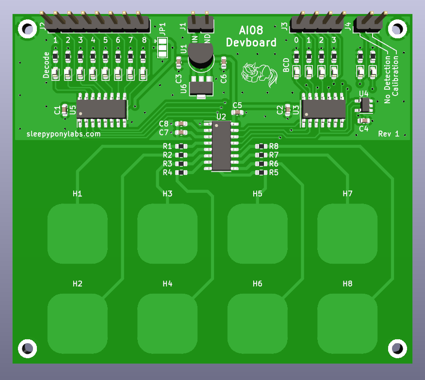
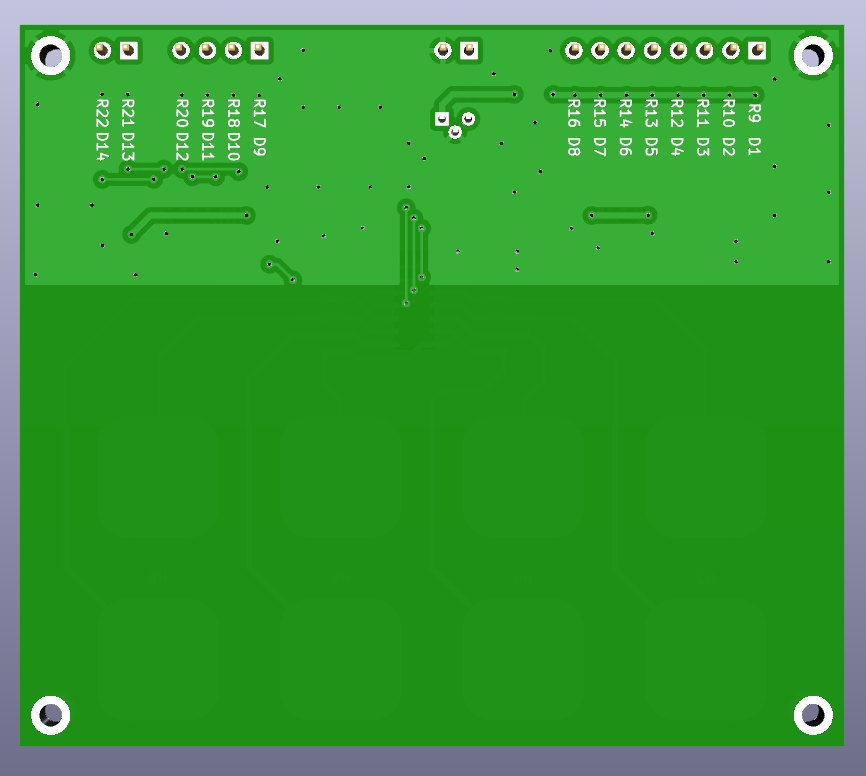

# AI08 Devboard

This is an open-source KiCAD design files for a development for [SAM&WING AI08](https://datasheet.lcsc.com/lcsc/2208221130_Sam-wing-AI08_C521987.pdf) 8-Channel Capacitive Touch Controller IC.

## Pictures

## Features

This devboard provides full flexibility for testing various configurations of the chip and surrounding circuits.

- AI08 Functions
	- Eight 12mm rounded-rectangle touch buttons. (No shield)
	- CSEL pad for sensitivity settings.
- Multiple Outputs
	- 4-bit BCD output (with indicator LEDs)
	- 8-bit decoded output (with indicator LEDs)
	- No Detection and Sleep Calibration indicator LEDs
	- 74HC138 is interchangable for 74HC238 for active-high decoded output.
- Built-In LDO
	- Built-in LDO for better noise reduction.
	- TO-92 and SOT-89 footprints.
	
## Revisions

We are currently at Revision 1. Changelog is below:

**Revision 1 (September 2022)**
 - Initial Design

## What is provided

The goal of this repository is to enable you to build this on your own as easy as possible (although I originally plan to sell this as a kit as well). **The schematics, PCB design, and an interactive BOM is provided.**

This project is licensed under the [Solderpad Hardware License v2.1](http://solderpad.org/licenses/SHL-2.1/). 
